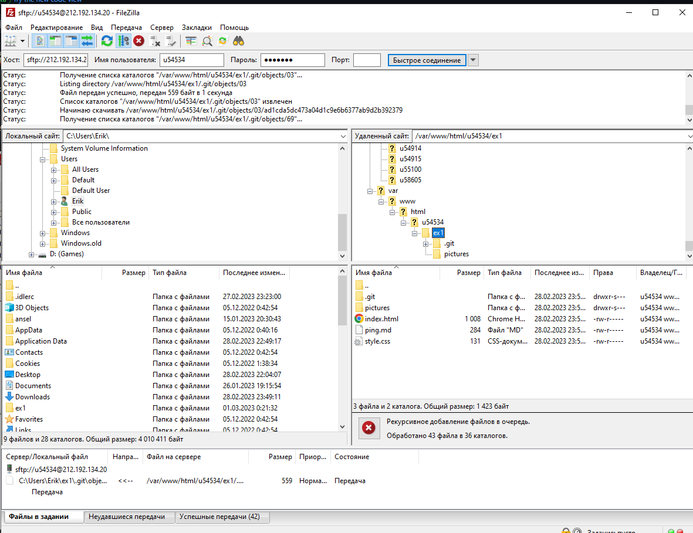

С помощью Putty клонируем git-репозиторий на учебный серве по адресу  /var/www/html/u54534/

Веб-страница из данного репозитория открывается по адресу http://u54534.kubsu-dev.ru/ex1/

С помощью FileZilla копируем загруженные на учебный сервер файлы к себе на локальное устройство(на скриншоте копируется на мой ПК)
